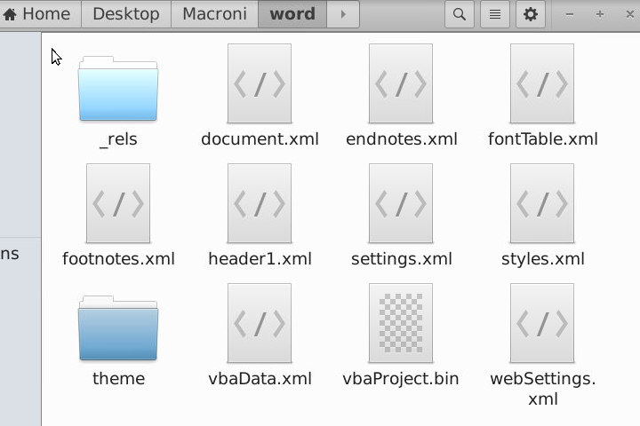
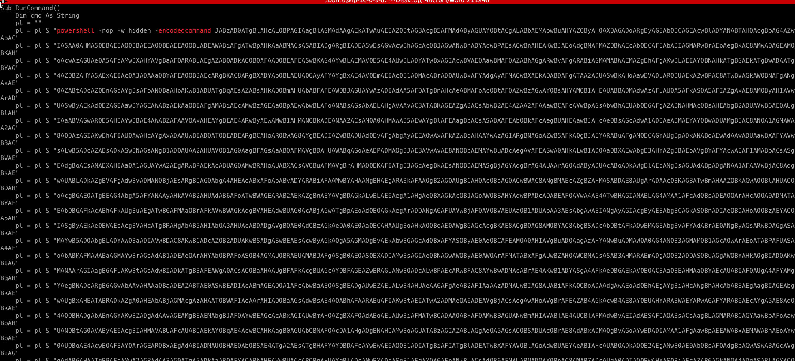
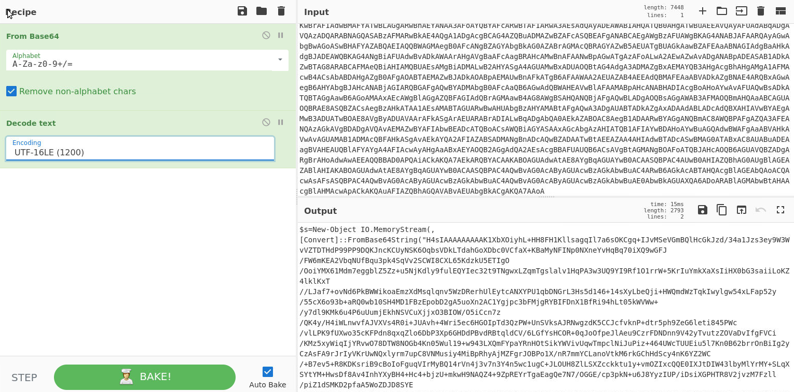
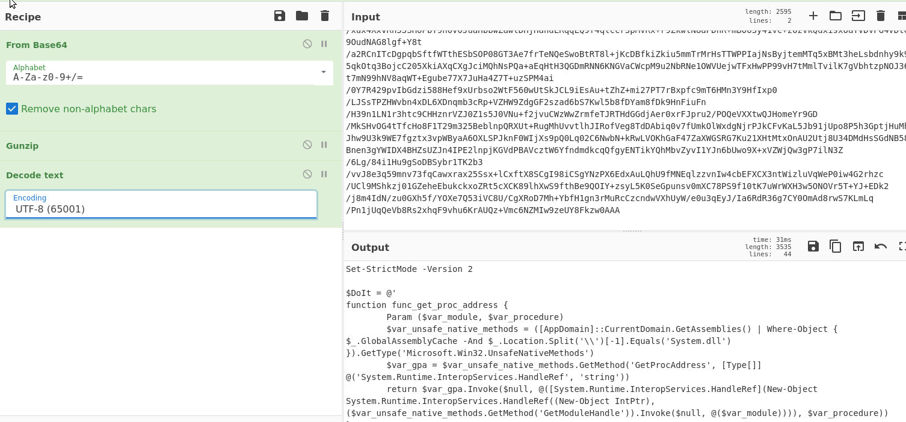
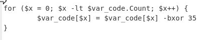
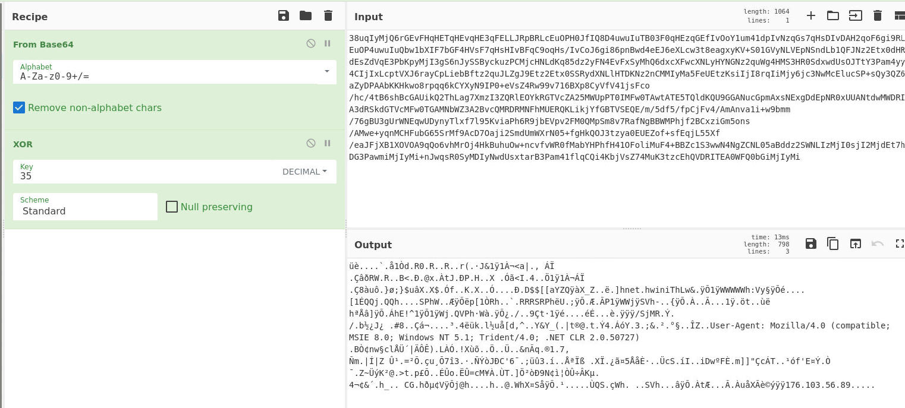

# Malware Analysis Writeup – Macroni.docm (BTLO Scenario)

## Scenario Overview

A phishing email bypassed email filtering controls and delivered a malicious Microsoft Word attachment to a user endpoint. The file, **Macroni.docm**, was executed in a sandbox environment by the incident response (IR) team.

Sandbox analysis indicated suspicious behavior upon execution, suggesting the presence of embedded macro code potentially responsible for shellcode execution or staged payload delivery. The objective of this investigation was to deobfuscate the payload in successive layers to identify the final command-and-control (C2) infrastructure.

---

## 1. Initial File Identification

The file under investigation was identified as:

**Macroni.docm**

The `.docm` extension indicates a Microsoft Word document with macro support. This is a common attack vector in phishing campaigns, as embedded VBA macros can execute system commands when the document is opened.


---

## 2. Extraction of Embedded Macros

To extract the embedded macro content, the file was renamed and unpacked:

```bash
Macroni.docm → Macroni.zip
````

After extraction, the internal structure of the Word document was revealed. The following file was identified as the primary macro container:

```
vbaProject.bin
```

This file contains compiled VBA macro code embedded within the document.




---

## 3. Macro Analysis Using olevba

The `vbaProject.bin` file was analyzed using the oletools framework:

```bash
/usr/local/bin/olevba vbaProject.bin
```

### Observations

The output revealed a `RunCommand()` function containing multiple malicious indicators, including:

* PowerShell execution (`Shell`)
* Execution policy bypass (`-nop`)
* Hidden window execution (`vbHide`)
* Obfuscated and encrypted string fragments



The payload was constructed incrementally using statements such as:

```vb
pl = pl & "..."
```


---

## 4. Payload Reconstruction

To reconstruct the full payload, the macro code was cleaned using regex to remove concatenation artifacts:

```regex
\s*pl = pl &
```

This resulted in a continuous Base64-encoded string representing the next-stage payload.

---

## 5. Base64 Decoding and UTF-16LE Interpretation

The extracted Base64 string was decoded using CyberChef and interpreted as UTF-16LE.



### Result

The decoded output revealed a PowerShell script. However, portions of the script remained obfuscated and required further decoding.

---

## 6. Gzip Decompression Layer

Within the PowerShell script, a decompression routine was identified:

```powershell
IEX (New-Object IO.StreamReader(
    New-Object IO.Compression.GzipStream($s,
    [IO.Compression.CompressionMode]::Decompress)
)).ReadToEnd();
```

### Interpretation

This confirmed the presence of a Gzip-compressed payload embedded within the script.

---

## 7. Gzip Decompression in CyberChef

The compressed portion of the script was processed using CyberChef with a **Gunzip** operation.



### Result

This revealed an additional PowerShell script layer, indicating a multi-stage obfuscation chain designed to delay analysis.

---

## 8. XOR Decryption Layer

Within the newly revealed script, an encrypted variable was identified:

```powershell
$var_code
```

This variable was referenced in the script and found to be XOR-obfuscated.



### Analysis

The XOR operation was applied to the extracted string using CyberChef, successfully decrypting the next payload layer.



---

## 9. Command-and-Control (C2) Discovery

The final decoded output revealed the attacker’s infrastructure:

```
176.103.56.89
```

This IP address represents the command-and-control (C2) server used to manage the infected system and potentially deliver additional payloads.

---

## Summary

The analysis of **Macroni.docm** demonstrates a multi-layered obfuscation and execution chain commonly used in macro-based phishing attacks.

### Attack Chain 

1. Malicious `.docm` file with embedded VBA macros
2. String concatenation obfuscation in VBA
3. Base64 encoding of PowerShell payload
4. UTF-16LE encoding layer
5. Gzip compression of embedded script
6. XOR encryption of final payload segment
7. Extraction of C2 infrastructure (176.103.56.89)

---

### Key Indicator of Compromise (IOC)

| Type          | Value         |
| ------------- | ------------- |
| C2 IP Address | 176.103.56.89 |

---

### MITRE ATT&CK Framework Mapping
| Tactic    | Technique                                       | ID        |
| --------- | ----------------------------------------------- | --------- |
| Execution | Command and Scripting Interpreter: Visual Basic | T1059.005 |
| Stealth   | Obfuscated Files or Information                 | T1027     |
