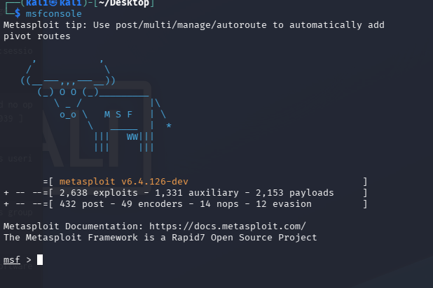

# SSH Brute Force Attack Detection with Splunk

**Lab Environment:** Kali Linux (Attacker) + Metasploitable 3 (Target) on an isolated host-only network
**Focus:** Simulating an SSH brute force attack and building a tuned Splunk detection alert

---

## Overview

This exercise demonstrates how to simulate an SSH brute force attack using the Metasploit Framework against a vulnerable target, then detect and alert on the attack behavior using Splunk SPL. The lab uses a home lab environment where a Kali Linux host and a Metasploitable 3 server share the same network segment.

**Attacker IP:** 192.168.56.101
**Target IP:** 192.168.56.103

---

## Step 1: Launching the SSH Brute Force Attack

Open the Metasploit Framework console on the Kali host:

```bash
msfconsole
```




Once inside the console, load the SSH login scanner module and configure it as follows:

```
use auxiliary/scanner/ssh/ssh_login
set RHOSTS 192.168.56.103
set USERNAME vagrant
set PASS_FILE /usr/share/wordlists/rockyou.txt
set VERBOSE true
run
```

This module iterates through the `rockyou.txt` wordlist, attempting to authenticate to the target's SSH service for the specified username. With `VERBOSE` enabled, each failed and successful attempt is printed to the console in real time.


---

## Step 2: Initial Detection in Splunk

During the attack, the target system logs each failed authentication attempt via `sshd`. These events are forwarded to Splunk and can be queried with the following SPL:

```spl
index=* host=192.168.56.103 "Failed password"
```

This surfaces all SSH authentication failure events from the target host.


---

## Step 3: Identifying the Source IP

Examining an individual event reveals that while Splunk does not automatically extract a `src_ip` field from sshd logs, the originating IP address and port are present within the raw event message (e.g., `from 192.168.56.101 port 39985`).


To extract the source IP dynamically, use a `rex` command to parse the field inline:

```spl
index=* host=192.168.56.103 "Failed password"
| rex "from (?P<src_ip>\d+\.\d+\.\d+\.\d+)"
| stats count by src_ip
```

This groups failed login events by the extracted source IP, making it easy to identify which host is generating the most failures.


> **Note on field extraction:** Rather than relying on `rex` in every query, a persistent field extraction can be configured in Splunk under **Settings → Fields → Field Extractions**. Creating a regex-based extraction for `src_ip` on the relevant sourcetype will make the field available natively across all searches and dashboards for future use.

---

## Step 4: Creating a Splunk Alert

With the detection logic validated, the next step is to configure a scheduled alert that fires when brute force activity is detected. The alert SPL adds a threshold filter to reduce noise from isolated login failures:

```spl
index=* host=192.168.56.103 "Failed password"
| rex "from (?P<src_ip>\d+\.\d+\.\d+\.\d+)"
| stats count by src_ip
| where count > 10
```

The `| where count > 10` clause ensures the alert only fires when a single source IP has generated more than 10 failed password events within the search window. This distinguishes a brute force pattern from a handful of legitimate users mistyping their credentials.

**Recommended alert settings:**

| Setting | Value |
|---|---|
| Title | SSH Brute Force Detected |
| Alert Type | Scheduled (e.g., every 5 minutes) |
| Time Range | Last 15 minutes |
| Trigger Condition | Number of Results > 0 |
| Severity | High |
| Throttle | Enabled (see Step 5) |

---

## Step 5: Smoke Testing and Alert Tuning

Re-run the Metasploit module to validate the alert fires correctly. The initial test confirms detection is working, but may produce multiple alerts in rapid succession — one per search interval — once the threshold is exceeded.


To suppress duplicate alerts while the attack is still ongoing, enable **Throttle** in the alert settings. Throttling suppresses re-notification for a configurable time window after the alert first fires, preventing alert fatigue without missing the initial detection.


**Recommended throttle period:** 60 minutes (adjust based on your environment's incident response SLA).

---

## Summary

| Phase | Action |
|---|---|
| Attack | SSH brute force via `auxiliary/scanner/ssh/ssh_login` |
| Detection | SPL search for `"Failed password"` on target host |
| Enrichment | `rex` extraction of `src_ip` from raw event message |
| Aggregation | `stats count by src_ip` to group failures per source |
| Alerting | `where count > 10` threshold to filter noise |
| Tuning | Throttle enabled to prevent duplicate alerts |
#### MITRE ATT&CK Mapping

|Tactic|Technique|ID|
|---|---|---|
|Credential Access|Brute Force|T1110|
|Credential Access|Password Guessing|T1110.001|
